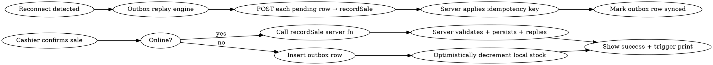

# Offline POS terminal — smart-POS device support for salespeople

**Date:** 2026-05-14
**Status:** Approved (brainstorm session, this session)
**Scope tier:** Major phase — new Android wrapper APK + offline-first cashier flow + device-pairing model

## Goal

Equip each salesperson with a smart-POS Android terminal (Sunmi V2s preferred, Telpo TPS900 fallback) that runs the existing inventory app, prints receipts directly from the device's built-in thermal printer, and keeps working for a full day with no network — syncing automatically once the connection returns.

## In scope

1. New Android wrapper APK that hosts a full-screen `WebView` for the existing inventory web app.
2. Universal printer adapter using ESC/POS over the device's built-in Bluetooth `InnerPrinter` (DantSu library). No vendor-specific SDK in v1.
3. Offline-capable cashier flow on the web side: PGlite local Postgres in WASM, ElectricSQL read-shape sync, write outbox for queued sales.
4. One-time device pairing flow: admin signs in, picks shop + assigned cashier, terminal locks to that pair.
5. Server-side `terminalDevices` registry — pairing, revocation, last-seen.
6. Offline payment-method gating — only Cash allowed when offline; Mobile Money and Card disabled.
7. Oversell handling — server accepts the sale, sets `oversellFlagged` for admin review.
8. Today's-sales reprint flow on the terminal (Bluetooth printer + cached sale data).
9. Service Worker for app-shell caching so the WebView boots offline.
10. Connectivity indicator + outbox queue visibility for the cashier.

## Out of scope (deferred / separate specs)

- **Vendor-specific printer adapters** (Sunmi AIDL, Telpo `com.telpo.tps550.api.printer`) — added later only if universal ESC/POS-over-Bluetooth doesn't cover a target device or we need cash-drawer kick.
- **Card reader / NFC contactless payments** — hardware is present on V2s; not wired in this phase.
- **Barcode scanner workflow for stock-in / stock-take** — separate phase, reuses device's 2D scanner.
- **Multi-cashier-per-device PIN switching** — decided against (one terminal = one salesperson).
- **Multi-shop-per-device** — decided against (terminal bound to one shop at pairing).
- **Offline MoMo with reconciliation flag** — explicitly rejected; cashier asks for cash when offline.
- **Reprint of sales older than today** — older reprints happen from manager's browser online.
- **Mobile-data / 4G cost reporting per device** — out of scope.
- **iOS support** — Sunmi/Telpo are Android-only; no iOS path.

## Decisions log (from brainstorm)

| Question | Decision |
|---|---|
| Offline duration target | Full day or more — full local DB |
| Cashier session model | One terminal = one salesperson, signed in for weeks |
| Stock conflict on oversell | Allow oversell, flag for admin review |
| Shop scope per terminal | Bound to one shop at pairing |
| Offline payment methods | Cash only (MoMo and Card blocked when offline) |
| Reprint window | Today's sales only |
| First target brand | Sunmi V2s (`Label & NFC, GMS variant`); Telpo TPS900 as procurement fallback |
| Printer integration | Universal ESC/POS over Bluetooth via `DantSu/ESCPOS-ThermalPrinter-Android` |
| Repo structure | Single repo; `android/` directory at root, no pnpm workspace |

## Architecture

### Big picture

```
┌──────────────────────────────── Smart-POS terminal (Sunmi V2s / Telpo TPS900) ─────────┐
│                                                                                        │
│   ┌──────────────────────────── Android wrapper APK ────────────────────────────┐      │
│   │                                                                             │      │
│   │   ┌─────────────────── WebView (full-screen) ──────────────────┐            │      │
│   │   │   Existing TanStack Start web app                          │            │      │
│   │   │     • Cashier UI: /pos, /pos/checkout, /pos/reprint        │            │      │
│   │   │     • PGlite (WASM Postgres) — local reads                 │            │      │
│   │   │     • Outbox table — local writes                          │            │      │
│   │   │     • ElectricSQL client — read-shape sync                 │            │      │
│   │   │     • Service Worker — app-shell + asset cache             │            │      │
│   │   │   window.posPrinter, window.posDevice  ← JS bridge         │            │      │
│   │   └────────────────────────────────────────────────────────────┘            │      │
│   │                                                                             │      │
│   │   PrinterAdapter (Kotlin interface)                                         │      │
│   │     └─ EscPosBluetoothAdapter (DantSu library)                              │      │
│   │   DevicePairing (Kotlin) — encrypted shared prefs                           │      │
│   └─────────────────────────────────────────────────────────────────────────────┘      │
└────────────────────────────────────────────────────────────────────────────────────────┘
       │                                              │
       │ HTTPS (TanStack server fns)                  │ HTTPS (sync only)
       ▼                                              ▼
┌──────────────────────────┐               ┌──────────────────────────┐
│ Cloudflare Workers       │◄──────────────│ ElectricSQL (Hetzner)    │
│  Drizzle, Better Auth    │  Postgres CDC │  pushes shape updates    │
└──────────┬───────────────┘               └──────────┬───────────────┘
           │                                          │
           └─────────► Neon Postgres ◄────────────────┘
```

Key shape choices:

- **WebView wraps the existing web app**, so cashier code stays unified across desktop and terminal.
- **Electric never writes** — it pushes read-only shape updates only. Writes go through TanStack server functions (online) or the outbox (offline → replay).
- **One write path** — outbox replays call the same server functions the online path uses, so validation, ledger posting, and stock decrement logic exist in exactly one place.
- **Universal printer adapter first.** Vendor SDKs only if we hit a device that doesn't expose its internal printer over Bluetooth.

### Repo layout

```
inventory/
├── src/                                    ← existing web app (existing)
│   ├── routes/pos.tsx                      ← existing
│   ├── routes/pos.checkout.tsx             ← existing
│   ├── routes/pos.reprint.tsx              ← NEW
│   ├── lib/offline/                        ← NEW
│   │   ├── pglite-client.ts                ← PGlite instance + bootstrap
│   │   ├── electric-shapes.ts              ← shape definitions
│   │   ├── outbox.ts                       ← outbox CRUD + replay engine
│   │   └── connectivity.ts                 ← online/offline probe
│   ├── lib/printing/
│   │   ├── receipt-payload.ts              ← shared payload schema (source of truth)
│   │   └── pos-printer-bridge.ts           ← typed wrapper for window.posPrinter
│   ├── components/pos/
│   │   ├── connectivity-indicator.tsx      ← NEW
│   │   ├── outbox-queue-badge.tsx          ← NEW
│   │   └── reprint-list.tsx                ← NEW
│   └── server/functions/
│       ├── terminal-devices.ts             ← NEW: pair/revoke/list
│       └── shop/sales.ts                   ← existing, extended with oversellFlagged + idempotencyKey
├── android/                                ← NEW
│   ├── app/
│   │   ├── build.gradle.kts
│   │   └── src/main/
│   │       ├── AndroidManifest.xml
│   │       ├── java/ug/.../inventorypos/
│   │       │   ├── MainActivity.kt          ← WebView host
│   │       │   ├── PosWebView.kt            ← WebView with JS bridge wiring
│   │       │   ├── bridge/
│   │       │   │   ├── PosPrinterBridge.kt
│   │       │   │   └── PosDeviceBridge.kt
│   │       │   ├── printer/
│   │       │   │   ├── PrinterAdapter.kt
│   │       │   │   └── EscPosBluetoothAdapter.kt
│   │       │   └── pairing/
│   │       │       ├── DevicePairing.kt     ← reads/writes encrypted prefs
│   │       │       └── PairingActivity.kt   ← admin sign-in + shop selection
│   │       └── res/
│   └── settings.gradle.kts
└── docs/hardware/                          ← existing
    └── recommended-pos-terminal.md         ← existing
```

No `pnpm` workspace. The web side and Android side don't share TypeScript/Kotlin code; they share *one schema file* (`receipt-payload.ts`) that the Android side reads as documentation and mirrors in a Kotlin data class.

## Offline data layer

### Local store: PGlite

PGlite (`@electric-sql/pglite`) — a full Postgres compiled to WASM, ~3MB gzipped, runs in the WebView. Used because:

- Matches the production Postgres schema exactly — no IndexedDB-vs-relational impedance.
- Plays natively with ElectricSQL (which is designed around PGlite as the local store).
- We can reuse Drizzle queries against it.

Persistence: PGlite stores in IndexedDB-backed VFS. WebView IndexedDB is persistent across reboots (we'll request persistent storage on first launch).

### What syncs to the terminal — Electric shapes

The terminal is bound to one shop and one cashier. We sync only what that pair needs:

```ts
// src/lib/offline/electric-shapes.ts
export const terminalShapes = (shopId: string, userId: string) => [
  { table: "shops", where: `id = '${shopId}'` },
  { table: "shop_locations", where: `shop_id = '${shopId}'` },          // address, phone for receipts
  { table: "users", where: `id = '${userId}'` },                        // cashier name for receipts
  { table: "products", where: "deleted_at IS NULL" },                   // full catalog (filtered by shop later if applicable)
  { table: "product_variants", where: "deleted_at IS NULL" },
  { table: "product_images", where: "is_primary = true" },              // primary image only — save bandwidth
  { table: "shop_stock", where: `shop_id = '${shopId}'` },              // stock-on-hand for this shop
  { table: "shop_sales", where: `shop_id = '${shopId}' AND sold_at >= NOW() - INTERVAL '24 hours'` },  // today's reprint window
  { table: "shop_sale_items", where: `shop_sale_id IN (SELECT id FROM shop_sales WHERE shop_id = '${shopId}' AND sold_at >= NOW() - INTERVAL '24 hours')` },
];
```

Initial sync size estimate for a clothing shop with ~2000 SKUs: ~5–15 MB. Subsequent syncs are diffs.

### Local-only tables (not synced)

```sql
-- Created by PGlite on first launch, never sent to server
CREATE TABLE outbox (
  id          UUID PRIMARY KEY DEFAULT gen_random_uuid(),
  operation   TEXT NOT NULL,                    -- e.g. 'recordSale'
  payload     JSONB NOT NULL,                   -- args for the server function
  idempotency_key UUID NOT NULL UNIQUE,         -- server dedupes on this
  status      TEXT NOT NULL DEFAULT 'pending',  -- pending | syncing | synced | failed
  retry_count INT NOT NULL DEFAULT 0,
  last_error  TEXT,
  created_at  TIMESTAMPTZ NOT NULL DEFAULT NOW(),
  synced_at   TIMESTAMPTZ
);

CREATE INDEX outbox_status_created ON outbox(status, created_at);
```

The outbox is the only place offline writes live until reconnect.

### Write flow



Critical: the receipt prints **immediately** whether the sale was online-confirmed or offline-queued. The customer always leaves with paper.

### Read flow

- All reads in `/pos` go to PGlite, not to the server.
- Electric keeps the local PGlite in sync with the production database when online.
- When offline, reads come from the last-synced snapshot. Stale by minutes (online) or hours (offline) — acceptable for a clothing shop.
- Stock-on-hand reads subtract any *locally pending* outbox decrements so the cashier sees a coherent view across queued sales.

## Connectivity, retry, and conflict handling

### Connectivity probe

`navigator.onLine` lies (it goes by interface state, not actual reachability). We use a lightweight heartbeat:

```ts
// src/lib/offline/connectivity.ts
async function probe(): Promise<boolean> {
  try {
    const r = await fetch("/__heartbeat", { method: "GET", cache: "no-store", signal: AbortSignal.timeout(3000) });
    return r.ok;
  } catch { return false; }
}
// Probe every 15s while idle, every 3s while there's a pending outbox row
```

The web app exposes a tiny `/__heartbeat` server function (returns `{ ok: true, serverTime }`).

### Retry policy

Outbox replay uses bounded exponential backoff:

| Attempt | Delay |
|---|---|
| 1 | immediate on reconnect |
| 2 | 5s |
| 3 | 30s |
| 4 | 5min |
| 5 | 30min |
| 6+ | 30min, capped, flag as `failed_needs_admin_review` after 12 total attempts |

Failed rows surface in a new admin queue at `/admin/outbox-failures` (separate UI; not in this spec's MVP unless trivial).

### Idempotency

Every outbox row carries a UUIDv7 `idempotency_key`. The server function `recordSale` is extended:

```ts
// src/server/functions/shop/sales.ts
const idempotencyKey = input.idempotencyKey ?? randomUUID();
return await db.transaction(async (tx) => {
  const existing = await tx.select().from(shopSales).where(eq(shopSales.idempotencyKey, idempotencyKey));
  if (existing.length > 0) return existing[0];   // already applied; return prior result
  // …existing insert logic…
});
```

We add `idempotency_key UUID UNIQUE` to `shop_sales` (DB migration).

### Oversell handling

Same `recordSale` transaction:

```ts
const stockBefore = await tx.select(...).from(shopStock).where(...);
const wouldGoNegative = stockBefore.quantityOnHand < item.quantity;

const oversellFlagged = wouldGoNegative;
// proceed with the decrement regardless — quantityOnHand may go negative
await tx.update(shopStock).set({
  quantityOnHand: sql`${shopStock.quantityOnHand} - ${item.quantity}`
}).where(...);

await tx.insert(shopSales).values({ ..., oversellFlagged });
```

New columns on `shop_sales`:
- `oversell_flagged BOOLEAN NOT NULL DEFAULT FALSE`
- `idempotency_key UUID UNIQUE NOT NULL`
- `recorded_offline BOOLEAN NOT NULL DEFAULT FALSE` (true if the row arrived via outbox replay)

Admin UI gets a "Flagged sales" filter in the existing sales list — no new screens needed for MVP.

### Failure modes the spec explicitly addresses

| Failure | Behaviour |
|---|---|
| Network drops mid-sale | Sale completes locally, queued in outbox, receipt prints, syncs on reconnect |
| Same item oversold by two offline terminals | Both sales record; the later-synced one gets `oversell_flagged = true` |
| Server rejects an outbox row (e.g. product deleted) | Row enters retry loop; after 12 attempts flagged for admin |
| Cashier session cookie expires offline | Outbox keeps queuing; server re-authenticates via stored refresh token on next online request. If refresh fails, terminal goes to a "Sign in again" screen but queued rows remain on disk |
| Cashier rings up Mobile Money offline | Payment-method buttons are disabled with a tooltip "Mobile Money requires internet" — *physically can't happen* |
| Printer disconnected mid-sale | Sale still persists; cashier sees "Reprint receipt" prompt; can retry print or reprint from `/pos/reprint` |
| Terminal lost/stolen | Admin marks device as revoked → next Electric sync attempt is refused with 403 → app shows "Device revoked, contact your manager" screen; queued outbox is held but cannot replay |

## Printer adapter

### Interface (Kotlin)

```kotlin
interface PrinterAdapter {
  suspend fun connect(): ConnectResult
  suspend fun printReceipt(payload: ReceiptPayload): PrintResult
  suspend fun status(): PrinterStatus
  suspend fun disconnect()
}

data class PrinterStatus(
  val connected: Boolean,
  val paperOk: Boolean,
  val batteryOk: Boolean,
  val lastError: String?
)

sealed class PrintResult {
  object Ok : PrintResult()
  data class Failed(val reason: String, val recoverable: Boolean) : PrintResult()
}
```

### Default implementation: `EscPosBluetoothAdapter`

```kotlin
class EscPosBluetoothAdapter(private val ctx: Context) : PrinterAdapter {
  private var printer: EscPosPrinter? = null

  override suspend fun connect(): ConnectResult {
    val connection = BluetoothPrintersConnections.selectFirstPaired()
      ?: return ConnectResult.NoPrinterPaired
    printer = EscPosPrinter(connection, 203, 48f, 32)  // 203 DPI, 48mm, 32 chars/line
    return ConnectResult.Ok
  }

  override suspend fun printReceipt(payload: ReceiptPayload): PrintResult {
    val esc = ReceiptEscPosFormatter.format(payload)  // builds DantSu's `[C]<b>...</b>` DSL
    return runCatching { printer?.printFormattedTextAndCut(esc); PrintResult.Ok }
      .getOrElse { PrintResult.Failed(it.message ?: "unknown", recoverable = true) }
  }

  // …
}
```

Library: [`com.dantsu:escposprinter:3.3.0`](https://github.com/DantSu/ESCPOS-ThermalPrinter-Android) (Maven Central, MIT).

### Device bridge (`window.posDevice`)

A second bridge exposes terminal identity and runtime info — useful so the web app can show the device label in the header and the battery state in the connectivity indicator.

```ts
interface PosDeviceBridge {
  deviceId(): string;             // from pairing, sent as x-device-id
  deviceLabel(): string;          // "Counter 1"
  hardwareModel(): string;        // "Sunmi V2s"
  appVersion(): string;
  androidVersion(): string;
  batteryLevel(): number;         // 0–100
  isCharging(): boolean;
}
```

The web app injects `x-device-id` on all fetches by reading `window.posDevice?.deviceId()`; server middleware validates it against the `terminal_devices` table.

### JavaScript bridge

Exposed to the WebView at `window.posPrinter`:

```ts
// src/lib/printing/pos-printer-bridge.ts — the shape, mirrored in Kotlin via @JavascriptInterface
interface PosPrinterBridge {
  isAvailable(): boolean;
  status(): Promise<PrinterStatus>;
  printReceipt(payloadJson: string): Promise<{ ok: true } | { ok: false; error: string }>;
}

declare global {
  interface Window {
    posPrinter?: PosPrinterBridge;
  }
}
```

Web app feature-detects:

```ts
const printer = window.posPrinter;
if (printer && (await printer.isAvailable())) {
  await printer.printReceipt(JSON.stringify(payload));
} else {
  await fallbackToHtmlPrintDialog(payload);     // existing `renderSaleReceipt()` flow
}
```

The HTML-print path (already at `src/lib/pdf/receipt-html.ts`) remains the fallback for any non-terminal context.

### Receipt payload (shared contract)

```ts
// src/lib/printing/receipt-payload.ts
export type ReceiptPayload = {
  shop: { name: string; address: string; phone: string };
  sale: {
    id: string;                 // human-readable sale ID
    soldAt: string;             // ISO
    cashierName: string;
    paymentMethod: "cash" | "mobile_money" | "card";
    recordedOffline: boolean;   // shown on receipt as a small "synced when online" note
  };
  items: Array<{
    name: string;
    variant: string;            // e.g. "Blue / L"
    quantity: number;
    unitPriceUgx: number;       // floored to nearest 50
    lineTotalUgx: number;
  }>;
  totals: {
    subtotalUgx: number;
    totalUgx: number;
  };
  footer: string;               // "Thank you. Returns within 7 days with receipt."
};
```

A Kotlin `data class ReceiptPayload` mirrors this; deserialised from the JSON the WebView sends.

## Device pairing & lifecycle

### First-launch flow

```
APK installed → PairingActivity launches (not MainActivity)
   ↓
"Pair this terminal"
   ↓
Admin signs in (online required — calls existing Better Auth)
   ↓
Picks shop from dropdown (server returns shops the admin can manage)
   ↓
Picks cashier user (server returns users with role=sales for that shop)
   ↓
Server creates terminal_devices row; using Better Auth's admin plugin,
mints a long-lived session for the chosen cashier user; returns
deviceId + the new cashier session cookie value
   ↓
Encrypted shared prefs stores: deviceId, shopId, cashierUserId
Android `CookieManager` is seeded with the cashier session cookie
   ↓
Admin's session cookie is discarded (terminal is now the cashier's)
   ↓
MainActivity opens WebView → /pos
```

### `terminal_devices` table (NEW)

```sql
CREATE TABLE terminal_devices (
  id              UUID PRIMARY KEY DEFAULT gen_random_uuid(),
  device_label    TEXT NOT NULL,                                  -- "Counter 1", set by admin at pairing
  shop_id         UUID NOT NULL REFERENCES shops(id),
  cashier_user_id UUID NOT NULL REFERENCES users(id),
  paired_at       TIMESTAMPTZ NOT NULL DEFAULT NOW(),
  paired_by_admin_id UUID NOT NULL REFERENCES users(id),
  last_seen_at    TIMESTAMPTZ,
  app_version     TEXT,
  android_version TEXT,
  hardware_model  TEXT,                                            -- e.g. "Sunmi V2s"
  status          TEXT NOT NULL DEFAULT 'active',                  -- active | revoked
  revoked_at      TIMESTAMPTZ,
  revoked_by_admin_id UUID REFERENCES users(id)
);
```

Each WebView request includes a `x-device-id` header. Server middleware checks that the device is `active` for every Electric sync and every write — if revoked, returns 403.

### Re-pairing

Admin signs in on the device again, taps "Re-pair this terminal". Picks new shop / cashier. Server records the change; old `terminal_devices` row is marked superseded. **Pending outbox rows block re-pair** — the UI shows the count and refuses to proceed until the device is online long enough to drain the queue (admin can manually flush via the outbox-queue screen first).

### Revocation

Admin marks a device revoked from `/admin/terminals`. Effects:

- Server stops accepting Electric sync from that `deviceId` (returns 403).
- WebView's next sync attempt sees 403 → app shows "Device revoked" screen, blocks new sales.
- Existing outbox rows stay on disk for forensic recovery but cannot replay.

### Auth on device

- Better Auth session cookie set on pairing has `Max-Age=90d` (vs. default 30d for browser sessions).
- WebView is configured with `CookieManager.getInstance().setAcceptCookie(true)` and persistent cookies (`setAcceptThirdPartyCookies` not needed; same origin).
- If the cookie expires while offline, sales still queue; on next online write the server returns 401, the WebView intercepts and prompts the cashier to sign in. Queued sales replay after re-auth (idempotency key prevents duplicates).

## UI additions for the cashier

### Connectivity indicator

Sticky in `/pos` header, next to avatar. Three states:

| State | Visual | Meaning |
|---|---|---|
| `online_synced` | Green dot, "Online" | Network up, outbox empty |
| `online_syncing` | Yellow dot, "Syncing N…" | Network up, N rows replaying |
| `offline` | Red dot, "Offline — sales will sync later" | Heartbeat failed |

### Outbox queue badge

If `outbox.status='pending' OR 'syncing'` count > 0, a small badge appears on the avatar dropdown showing the count. Tapping opens a list of queued sales with their timestamps and a manual "Retry now" button (in case the cashier knows they're back online).

### Payment-method gating

The existing payment-method step in `checkout-sheet.tsx` reads `useConnectivity()` hook. When offline:

- "Cash" button: enabled, primary action
- "Mobile Money" button: disabled, tooltip "Requires internet"
- "Card" button: disabled, tooltip "Requires internet"

### Reprint screen (`/pos/reprint`)

New route, accessible from the avatar dropdown. Shows today's sales (last 24h) from local PGlite as a card list — newest first. Each card has: sale ID, time, total, payment method, "Reprint" button. Tapping "Reprint" calls `window.posPrinter.printReceipt(payload)`.

### "Sale completed but receipt didn't print" recovery

After `recordSale` (online or queued), if `printReceipt()` returns `{ ok: false }`, show a banner: "Sale saved. Receipt didn't print — try again?" with a "Reprint" button. Sale is never lost because of a printer failure.

## Service Worker & PWA

### What we cache

- All static assets emitted by the Vite build (JS, CSS, fonts, icons) — cache-first
- App-shell HTML for `/pos`, `/pos/checkout`, `/pos/reprint` — cache-first with stale-while-revalidate
- `manifest.json` — already exists, extend with `start_url: "/pos"` and `display: "fullscreen"` for terminal mode (detected by query string `?terminal=1`)

### What we DO NOT cache

- Server function endpoints (`/_serverFn/...`) — always network when online; outbox handles offline
- Electric sync endpoints — Electric handles its own caching

### Implementation

`vite-plugin-pwa` with `workbox` runtime caching rules. On install, requests persistent storage:

```ts
if ("storage" in navigator && "persist" in navigator.storage) {
  await navigator.storage.persist();
}
```

WebView grants this without prompt (Android WebView storage is already persistent within the app's data directory).

## Testing strategy

### Unit tests

- `src/lib/offline/outbox.ts` — state transitions, retry backoff, idempotency-key generation, recovery from corrupt rows.
- `src/lib/offline/connectivity.ts` — heartbeat probe with mocked fetch.
- `src/lib/printing/receipt-payload.ts` — schema validation.

### Integration tests

- `recordSale` server function — idempotency-key path: same key twice returns the same row, no duplicate ledger entries.
- `recordSale` — oversell path: stock goes negative, `oversell_flagged = true`.
- `terminal_devices` revocation — sync returns 403 after revoke.
- Outbox replay against a real PGlite instance (Vitest with `@electric-sql/pglite` in test env).

### E2E (Cypress)

- Offline → online round trip: ring up a sale with the network throttled to "offline", confirm sale shows in local state, restore network, assert it lands in the server DB with `recorded_offline = true`.
- Reprint flow: ring up a sale, navigate to reprint, verify the same payload is sent to (a mocked) `window.posPrinter`.
- Payment-method gating: offline mode disables MoMo/Card buttons.

### Manual smoke tests on hardware (when devices arrive)

- Pairing flow on a real device.
- ESC/POS print quality on real receipts.
- Battery-life check across a simulated 10-hour shift with 50 sales.
- Drop test (vendor-tested for V2s; verify dock doesn't fail).
- 4G fallback when WiFi is killed mid-sale.

### Mock printer bridge for browser dev

```ts
// dev-only: if running outside the WebView, install a mock that opens the existing HTML print preview
if (import.meta.env.DEV && !window.posPrinter) {
  window.posPrinter = createMockPrinterBridge();
}
```

## Migrations

```sql
-- 2026-05-14-offline-pos.sql
ALTER TABLE shop_sales ADD COLUMN idempotency_key UUID UNIQUE;
ALTER TABLE shop_sales ADD COLUMN recorded_offline BOOLEAN NOT NULL DEFAULT FALSE;
ALTER TABLE shop_sales ADD COLUMN oversell_flagged BOOLEAN NOT NULL DEFAULT FALSE;

CREATE TABLE terminal_devices (
  -- as specified above
);

CREATE INDEX shop_sales_oversell ON shop_sales(oversell_flagged) WHERE oversell_flagged = TRUE;
CREATE INDEX terminal_devices_active ON terminal_devices(status, shop_id);
```

`idempotency_key` is nullable on existing rows (backfilled with `gen_random_uuid()` on migration, then set NOT NULL in a follow-up migration once all old rows have one — split to keep the migration cheap on Neon).

## Sequencing

The work breaks into roughly five sub-phases (each suitable for its own `gsd:plan-phase` cycle):

1. **Server foundations** — migrations, `terminal_devices` CRUD, idempotency key on `recordSale`, oversell flag, `/admin/terminals` minimal UI, `x-device-id` middleware.
2. **Web offline core** — PGlite bootstrap, Electric client wiring with one shop's shapes, outbox table + replay engine, connectivity probe, service worker.
3. **Cashier UX additions** — connectivity indicator, outbox badge, payment-method gating, reprint screen.
4. **Android wrapper APK** — Kotlin project skeleton, WebView host, pairing activity, encrypted prefs, `x-device-id` header injection.
5. **Printer integration** — `EscPosBluetoothAdapter`, JS bridge, `ReceiptEscPosFormatter`, hardware smoke tests on a real V2s.

Phases 1–3 can ship to production for desktop browsers first (offline-capable web app benefits everyone). Phase 4–5 land when the first physical device arrives.

## Open questions

1. **Terminal time-source.** Sunmi/Telpo devices have a system clock that can drift. Should the server reject sales whose `soldAt` is more than N hours skewed from server time? Suggested policy: clamp `soldAt` server-side to `min(client_sold_at, now)` and log skew for telemetry. Resolve during phase 1 implementation.
2. **Receipt language.** Currently all UI is in English. Receipts likewise — but if the client wants Luganda for the customer-facing portion, that's an i18n table on `shop_locations` (`receipt_thank_you_text`). Punt to phase 3 if confirmed.
3. **Electric self-hosted concurrency.** The Hetzner Electric instance hasn't been load-tested with multiple terminals. Suggested: phase 2 includes a 5-terminal soak test. If Electric becomes a bottleneck, fallback is polling-based sync over the existing TanStack server fns (less elegant but bounded).
4. **APK distribution.** No Play Store presence yet. Initial distribution will be sideload via USB or a private link to the APK. Plan to set up Sunmi App Store / Telpo App Store accounts when fleet size justifies it.
